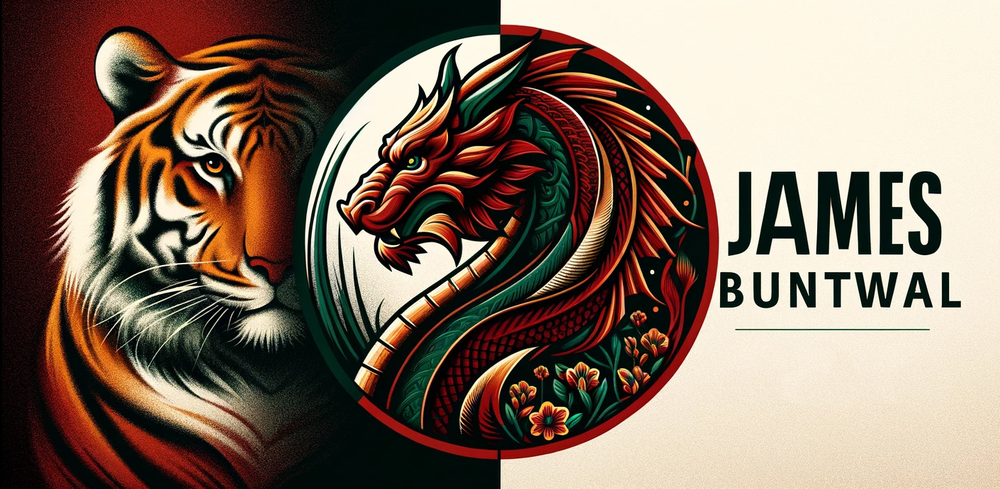
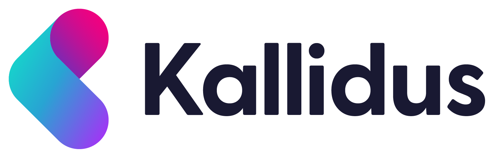
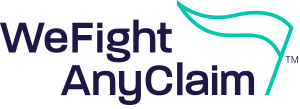

<!-- Header Banner Image -->

---

<!-- Vistors Counter -->
<h1 align="center">

</h1>

<!-- Socials -->
<h1 align="center">

</h1>
<h1 align="center">

</h1>

## About Me

Here's a DALL-E generated image that tries to capture a few of my hobbies and interests!

✈️ Travelling 🧑‍💻 Coding ☕️ Coffee 💻 Gadgets & Technology
 

🏞️ The Outdoors 🏉 Rugby 🎾 Tennis 🐈‍⬛ Cats 🐕 Dogs

🎸 Guitar 🎧 Music 👨‍👨‍👧‍👦 Family & Friends

## Recent Projects
While the majority of my work cannot be shared due to it being proprietary to the companies I've worked for, I try to upload projects that I can make public here. Please see the links and descriptions below.

> <b>[Property Data Analysis](https://github.com/JamesBuntwal/PropertyDataAnalysis)</b>
>
> This was a piece of analysis I undertook as part of an application to a Senior Data Scientist role. I received excellent feedback.
> 
> <b>[Managing Datetime Partitions](https://github.com/JamesBuntwal/ManageDT)</b>
>
> This is a small class I created whilst working at Crimtan. We used hourly partitions within the hive database so I created this class to more conveniently manage the use of these partitions. It contains useful type conversions and various methods for iteration. It significantly reduced the bulkiness of my data manipulation code.

## Data Science & Analytics Experience

  <a align="left">
    
  ### Senior Data Scientist
  #### Kallidus, Nov 2024 - Present
  </a>

>                 
>
>     
>
> A large part of my role at Kallidus is to help develop and upskill the team of software engineers and developers with regards to Data Science best practices and ways of working, as well as teaching Data Science fundamentals.
> 
> 

Company

>
> Kallidus specialises in developing cutting-edge HR and learning software that helps businesses manage their people more effectively. Their solutions include tools for recruitment, onboarding, learning and development, performance management, and employee engagement. Their goal is to simplify and enhance the employee experience while driving growth and productivity for organizations. It’s all about empowering companies to support and develop their teams at every stage of the employee journey.
> 
> 

>
> 

> 
 Projects 

>
> - Customer Churn per Product (Binary Classification).
> - Lesson Recommender System (Single Value Decomposition).
> - LLM output analysis.
  
>
> 

  <a align="left">
    
  ### Senior Data Scientist
  #### Crimtan, Feb 2024 - July 2024
  </a>

>               
>
>     
>
> Unfortunately I was made redundant from this role in July 2024.
> 
> 

Company

>
> Crimtan is an ad tech company established with a mission to simplify the complex world of programmatic advertising. The company provides a comprehensive lifecycle marketing solution that integrates consent, planning, targeting, and measurement using its proprietary technology. Crimtan delivers tailored, high-performing campaigns across various industries globally. They focus on transparency and compliance, ensuring customer privacy while achieving exceptional return on investment.
> 
> 

>
> 

> 
 Projects 

>
> - Click Fraud detection - Reverse engineer a third party's click validity flag.
>
> 

  <a align="left">
    
  ### Data Scientist
  #### Dwr Cymru Welsh Water, 2019 - 2024
  </a>
  

>                    
>
>     
> 
> 

Company

>
> Dŵr Cymru Welsh Water is a not-for-profit company which supplies drinking water and wastewater services to most of Wales and parts of western England that border Wales. In total, it serves around 1.4 million households and businesses, around three million people, and supplies nearly 830 million litres of drinking water per day.
>
> 

>
> 

Projects

>
> - End to end machine learning pipelines for predictive modelling. 
> - Using data and building tools that solve problems and increase the analytical intelligence that goes into large scale decisioning.
> - Working with stakeholders to identify problem areas and creating solutions to those problems.
> - Following Agile methodologies and the CRISP-DM life cycle.
> 
> > 

> > 
 SRV Bacteria Predictor 

> > 
> > An ensemble model with a Gini Coefficient of 70+ was developed to identify service reservoir assets at risk of ecoli failures to direct manual investigations.
> > Water quality samples are regularly taken from each of the 300+ service reservoirs located across Wales. These samples are analysed and the data uploaded to a centralised database.
> > A legacy model was historically used to identify assets but stakeholders felt its performance had degraded to the point of no longer being fit for purpose.
> > This model redevelopment project included: 
> > - Extensive EDA.
> > - Data drift analysis.
> > - 10, 000: 1 class imbalance.
> > - Low capacity for on-site investigation required minimal false positives.
> > - Interactive Power-BI Dashboard.
> > - SMOTE & TOMEK link resampling.
> > - Supervised Discritisation.
> > - Azure Virtual Machines & DevOps Pipelines.
> > 

> > 
> > 

> > 
 Other Projects 

> > 
> > - CSO Monitoring
> > - Risk Assessment Risk Index
> > - Property Risk Profile
> > - Model Monitoring Suite
> > 

> 

<!--
> > 

> > 
 Risk Assessment Risk Index 

> > details of project
> > 

>
> > 

> > 
 Property Risk Profile 

> > details of project
> > 

>
> > 

> > 
 Model Monitoring Suite 

> > details of project
> > 

>
>  -->

  
  ### Scorecard (Credit Risk) Analyst
  #### MotoNovo Finance, 2017 - 2019

<!--
> 
>   
>  -->
>       
>
>     
>
> 

> 
 Company 

>
> One of the UK's fastest growing independent finance companies, helping thousands of people fund the purchases of cars, vans, and bikes. Working with thousands of dealer partners across the UK, they've been in the industry for over 40 years and are now part of the Aldermore Group.
> 
> 

>
> 

> 
 Projects 

>
> Building and monitoring credit risk models; predominantly logistic regressions and decision trees, and Customer analytics.
> 
> - Loan Application Models
> - Behavioural Models (Roll, Recovery etc.)
> - Customer Affordability Models
> - Significant Increase in Credit Risk (SICR) (Regulatory)
> - Propensity to Purchase GAP Insurance
> 

  
### Data Analyst
#### We Fight Any Claim, 2016 - 2017

<!--
> 
>   
-->
>      
>
>    
> 
> 

> 
 Company 

>
> We Fight Any Claim was one of the UK’s most successful Claims Management Companies and proudly helped over 220,000 customers claim back over £600 million in compensation for mis-sold PPI. In August 2019, the Financial Conduct Authority introduced a deadline for making payment protection insurance complaints. From April 2020, We Fight Any Claim ceased claims management services and commenced an extensive exercise to review outstanding accounts and to exchange information with lenders to conclude remaining claim activity for existing customers.
>
> 

>
> 

> 
 Projects 

>
> - Monitored and forecasted business KPI's
> - Used 'Google Analytics' to analyse website traffic and product performance.
> - Created a data driven target setting system for telephony staff performance targets.
> 

<!--
<h2>

💧 Data Scientist for Dwr Cymru Welsh Water

🎸🎾🎵

</h2>

**JamesBuntwal/JamesBuntwal** is a ✨ _special_ ✨ repository because its `README.md` (this file) appears on your GitHub profile.

Here are some ideas to get you started:

- 🔭 I’m currently working on ...
- 🌱 I’m currently learning ...
- 👯 I’m looking to collaborate on ...
- 🤔 I’m looking for help with ...
- 💬 Ask me about ...
- 📫 How to reach me: ...
- 😄 Pronouns: ...
- ⚡ Fun fact: ...
-->
